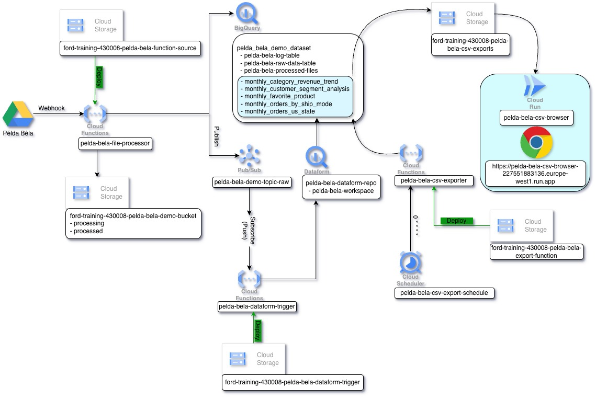

# Terraform GCP Training - Step-by-Step Guide 🚀

Terraform alapok gyakorlati példákkal Google Cloud Platform-on - Teljes Data Pipeline építése Google Drive-ból BigQuery-be, webes böngészővel.

---

## 📚 Áttekintés

Ez a training **12 lépésben** vezet végig egy komplett **event-driven data pipeline** építésén GCP-n, fokozatosan bővülő példákkal.

Minden lépés egy külön könyvtárban van, és **építkezik az előző lépésekre**.

---

## 🎯 Lépések

| Step | Könyvtár | Leírás | ÚJ Resources |
|------|----------|--------|--------------|
| **00** | `step-00/` | Előkészületek (Terraform telepítés, SA kulcs) | 0 |
| **01** | `step-01-setup/` | Terraform setup és konfiguráció ellenőrzés | 0 |
| **02** | `step-02-service-account/` | Service Account létrehozása | 1 |
| **03** | `step-03-storage/` | Storage Bucket hozzáadása | 1 |
| **04** | `step-04-bigquery/` | BigQuery Dataset és 3 Table | 4 |
| **05** | `step-05-iam/` | IAM jogosultságok (Bucket, BQ, Project) | 3 |
| **06** | `step-06-cloud-function-processor/` | File Processor Function + Pub/Sub | 6 |
| **08** | `step-08-dataform/` | BigQuery Aggregált Táblák (5 db) + Dataform | 9 |
| **09** | `step-09-dataform-trigger/` | Dataform Trigger Function (Pub/Sub) | 8 |
| **10** | `step-10-scheduled-export/` | CSV Export Function + Cloud Scheduler | 9 |
| **11** | `step-11-website/` | CSV Browser Website (Cloud Run + Flask) | 3 |

**Összesen: ~44 GCP resource + 1 Docker image + 1 Webes alkalmazás**

---

## 🏗️ Teljes Pipeline Architektúra

```
📁 Google Drive
    ↓ (webhook)
🔵 Cloud Function: File Processor (Step 06)
    ├─→ 📦 GCS: Raw Files
    ├─→ 📊 BigQuery: raw_data table
    └─→ 📢 Pub/Sub: file-processed topic
         ↓
🔵 Cloud Function: Dataform Trigger (Step 09)
    ├─→ 🔨 Dataform: Compilation
    └─→ ▶️ Dataform: Workflow Invocation
         ↓
📊 BigQuery: Aggregált Táblák (Step 08)
    ├─→ monthly_orders_by_ship_mode
    ├─→ monthly_orders_us_state
    ├─→ monthly_favorite_product
    ├─→ monthly_customer_segment_analysis
    └─→ monthly_category_revenue_trend
         ↓
⏰ Cloud Scheduler (óránként) (Step 10)
    ↓
🔵 Cloud Function: CSV Exporter
    └─→ 📦 GCS: CSV Export Bucket
         └─→ table_name/YYYY-MM-DD_HHMMSS.csv
              ↓
🌐 Cloud Run: CSV Browser Website (Step 11)
    └─→ Flask Web App
         ├─→ 📂 Mappa böngészés
         ├─→ 📄 CSV listázás
         └─→ ⬇️ Fájl letöltés
```

<p align="center">
  
</p>

---

## 🚀 Gyors Start

### 1️⃣ Előkészületek (Step 00)

```bash
# Navigálj a step-00 könyvtárba és kövesd az útmutatót
cd step-00/
cat README.md
```

**Mit csinálsz:**
- Terraform telepítés/upgrade (>= 1.13.0)
- Service Account kulcs letöltése
- GitHub repo klónozása

### 2️⃣ Lépésről lépésre haladás

**FONTOS:** Minden step az előző step-ekre épül! Ne ugorj át lépéseket!

```bash
# 1. Navigálj a step könyvtárába
cd step-02-service-account/

# 2. Másold át a példafájlt
cp terraform.tfvars.example terraform.tfvars

# 3. Szerkeszd a terraform.tfvars-t (állítsd be user_name-t)
nano terraform.tfvars

# 4. Init
terraform init

# 5. Plan
terraform plan

# 6. Apply
terraform apply

# 7. (Opcionális) Cleanup - CSAK ha nem akarod folytatni!
# terraform destroy
```

**Minden step-hez tartozik részletes README!**

---

## 📖 Részletes Lépések

### Step 00: Prerequisites & Setup
**Könyvtár:** `step-00/`

Terraform telepítés, Service Account kulcs beszerzése, repo klónozása.

**Mit tanulsz:**
- GCP CloudShell használat
- Terraform telepítés/upgrade
- SA kulcs kezelés

---

### Step 01: Terraform Setup
**Könyvtár:** `step-01-setup/`

Terraform konfiguráció ellenőrzése. **Nincs resource létrehozás.**

**Mit tanulsz:**
- `terraform init` - provider letöltés
- `terraform validate` - konfiguráció ellenőrzés
- `terraform plan` - előnézet
- Provider és variable konfiguráció

---

### Step 02: Service Account
**Könyvtár:** `step-02-service-account/`

**ÚJ Resources:**
- ✅ 1x Service Account

**Mit tanulsz:**
- Resource létrehozás
- Local variables használata
- String interpolation
- Outputs

---

### Step 03: Storage Bucket
**Könyvtár:** `step-03-storage/`

**ÚJ Resources:**
- ✅ 1x Storage Bucket (raw data tárolás)

**Data Sources:**
- 📌 Service Account (step-02-ből)

**Mit tanulsz:**
- Data source használata (létező resource-ra hivatkozás)
- Storage Bucket konfiguráció
- Naming conventions
- Multi-step projektek

---

### Step 04: BigQuery
**Könyvtár:** `step-04-bigquery/`

**ÚJ Resources:**
- ✅ 1x BigQuery Dataset
- ✅ 1x BigQuery Log Table (7 oszlop)
- ✅ 1x BigQuery Raw Data Table (18 oszlop)
- ✅ 1x BigQuery Processed Files Table (5 oszlop)

**Data Sources:**
- 📌 Service Account (step-02-ből)
- 📌 Storage Bucket (step-03-ból)

**Mit tanulsz:**
- BigQuery resource-ok
- Nested resources (table a dataset-ben)
- JSON schema definíció
- Resource dependencies
- Timestamp és Date típusok

---

### Step 05: IAM Bindings
**Könyvtár:** `step-05-iam/`

**ÚJ Resources:**
- ✅ 1x Storage Bucket IAM Binding (Object Admin)
- ✅ 1x BigQuery Dataset IAM Binding (Data Editor)
- ✅ 1x Project IAM Binding (BigQuery Job User)

**Data Sources:**
- 📌 Service Account (step-02-ből)
- 📌 Storage Bucket (step-03-ból)
- 📌 BigQuery Dataset (step-04-ből)
- 📌 BigQuery Tables (step-04-ből)

**Mit tanulsz:**
- IAM role bindings
- Service Account jogosultságok
- Dataset vs. Project szintű jogok
- `roles/storage.objectAdmin`
- `roles/bigquery.dataEditor`
- `roles/bigquery.jobUser`

---

### Step 06: Cloud Function File Processor
**Könyvtár:** `step-06-cloud-function-processor/`

**ÚJ Resources:**
- ✅ 1x Pub/Sub Topic
- ✅ 1x Pub/Sub Publisher IAM Binding (PROJECT szintű)
- ✅ 1x Storage Bucket (Function source code)
- ✅ 1x Storage Bucket Object (ZIP fájl)
- ✅ 1x Cloud Function Gen2 (HTTP trigger, Python 3.12)
- ✅ 1x Cloud Run Service IAM Binding (Gen2 invoker)

**Data Sources:**
- 📌 Service Account (step-02-ből)
- 📌 Storage Bucket - adatok (step-03-ból)
- 📌 BigQuery Dataset, Tables (step-04-ből)

**Manuális lépés:**
- 🔓 Unauthenticated access beállítása (GCP Console)

**Mit tanulsz:**
- Cloud Functions Gen2 (Cloud Run alapú)
- Pub/Sub Topic létrehozása
- HTTP trigger használat
- Python 3.12 function
- Function source code packaging (ZIP)
- Unauthenticated access beállítása
- Event-driven architektúra

**Pipeline lépés:**
1. Drive webhook hívja a function-t
2. Function letölti a fájlt Drive-ból
3. Feltölti GCS-be
4. Betölti BigQuery raw_data táblába
5. Pub/Sub message küldés

---

### Step 08: Dataform Aggregált Táblák
**Könyvtár:** `step-08-dataform/`

**ÚJ Resources:**
- ✅ 5x BigQuery Aggregált Tábla (üres sémákkal):
  - `monthly_orders_by_ship_mode`
  - `monthly_orders_us_state`
  - `monthly_favorite_product`
  - `monthly_customer_segment_analysis`
  - `monthly_category_revenue_trend`
- ✅ 1x BigQuery Dataset IAM Binding (Data Editor)
- ✅ 1x Project IAM Binding (Job User)
- ✅ 2x Project IAM Binding (Dataform SA jogok)
- ✅ 5x Generált SQLX fájl (template-ekből)
- ✅ 1x DATAFORM_SETUP.md instrukciós fájl

**Data Sources:**
- 📌 Service Account (step-02-ből)
- 📌 Storage Bucket (step-03-ból)
- 📌 BigQuery Dataset, Tables (step-04-ből)
- 📌 Pub/Sub Topic, Cloud Function (step-06-ból)

**Manuális lépés:**
- 🔨 Dataform Repository és Workspace létrehozása (GCP Console)
- 📤 SQLX fájlok feltöltése

**Mit tanulsz:**
- BigQuery aggregált táblák
- Template fájlok generálása (`templatefile()`)
- SQLX fájlok írása
- WITH clause és ablakfüggvények
- Dataform workflow (manuális setup)
- IAM project szintű jogok

**Pipeline lépés:**
1. Dataform workflow SQL transzformációk futtatása
2. raw_data tábla → 5 aggregált tábla

---

### Step 09: Dataform Trigger Function
**Könyvtár:** `step-09-dataform-trigger/`

**ÚJ Resources:**
- ✅ 1x Storage Bucket (Function source code)
- ✅ 1x Storage Bucket Object (ZIP fájl)
- ✅ 1x Cloud Function Gen2 (Pub/Sub trigger, Python 3.12)
- ✅ 5x IAM Binding (Cloud Run Invoker, SA User, Pub/Sub Subscriber, Dataform Editor)

**Data Sources:**
- 📌 Service Account (step-02-ből)
- 📌 Storage Bucket (step-03-ból)
- 📌 BigQuery Dataset, Tables (step-04-ből)
- 📌 Pub/Sub Topic (step-06-ból)

**Mit tanulsz:**
- Cloud Functions Gen2 Pub/Sub trigger
- Event-driven architecture
- Dataform REST API használata
- Compilation Result és Workflow Invocation
- OAuth2 authentication
- Retry policy

**Pipeline lépés:**
1. Pub/Sub message érkezik (step-06-ból)
2. Function létrehoz Dataform compilation-t
3. Function elindítja Dataform workflow-t
4. Aggregált táblák frissülnek

---

### Step 10: Scheduled CSV Export
**Könyvtár:** `step-10-scheduled-export/`

**ÚJ Resources:**
- ✅ 1x Storage Bucket (CSV export-ok, 30 napos lifecycle)
- ✅ 1x Storage Bucket (Function source code)
- ✅ 1x Storage Bucket Object (ZIP fájl)
- ✅ 1x Cloud Function Gen2 (HTTP trigger, Python 3.12)
- ✅ 1x Cloud Scheduler Job (óránkénti futás)
- ✅ 3x IAM Binding (Cloud Run Invoker, Storage Admin, BQ Viewer)

**Data Sources:**
- 📌 Service Account (step-02-ből)
- 📌 BigQuery Dataset (step-04-ből)
- 📌 BigQuery Log Table (step-04-ből)
- 📌 5x BigQuery Aggregált Táblák (step-08-ból)

**Mit tanulsz:**
- Cloud Scheduler létrehozása
- Cron expression (`0 * * * *`)
- Timezone beállítása
- HTTP trigger function
- OIDC authentication
- Pandas CSV export
- GCS strukturált feltöltés
- Lifecycle rule (retention)

**Pipeline lépés:**
1. Cloud Scheduler óránként elindítja a function-t
2. Function exportálja az 5 aggregált táblát CSV-be
3. Feltölti GCS-be struktúrált mappákba:
   ```
   csv-export-bucket/
   ├── monthly_orders_by_ship_mode/
   │   ├── 2024-01-15_060000.csv
   │   └── 2024-01-15_070000.csv
   └── ...
   ```

---

### Step 11: CSV Browser Website
**Könyvtár:** `step-11-website/`

**ÚJ Resources:**
- ✅ 1x Cloud Run Service (Flask web app, Python 3.11)
- ✅ 2x IAM Binding (Cloud Run Invoker - allUsers, Storage Viewer - SA)

**Data Sources:**
- 📌 Service Account (step-02-ből)
- 📌 CSV Export Bucket (step-10-ből)

**Manuális lépések:**
- 🔨 Docker image build és push (gcr.io)
- 🔓 Unauthenticated access beállítása (GCP Console)

**Mit tanulsz:**
- Docker image build és push
- Cloud Run service deployment
- Flask web alkalmazás
- Google Cloud Storage SDK
- Bootstrap UI (responsive)
- Streaming file download
- Public web access (unauthenticated)

**Pipeline lépés:**
1. Webes böngésző a Cloud Run URL-en
2. Flask app listázza a CSV fájlokat (mappákban strukturálva)
3. User kiválaszt egy fájlt
4. Flask stream-eli a fájlt közvetlenül a GCS bucket-ből
5. CSV letöltődik a user gépére

**Funkciók:**
- 📂 Mappa böngészés (breadcrumb navigáció)
- 📄 CSV fájlok listázása (név, méret, dátum)
- ⬇️ Fájl letöltés (direct stream)
- 🎨 Bootstrap UI (modern dizájn)
- 🌐 Public access (nincs login szükséges)

---

## 🗑️ Cleanup (Teljes infrastruktúra törlése)

**FONTOS:** Fordított sorrendben töröld a step-eket!

```bash
# 1. Step-11
cd step-11-website/
terraform destroy
# Docker image törlése (opcionális)
gcloud container images delete gcr.io/ford-training-430008/${YOUR_NAME}-csv-browser:latest --quiet

# 2. Step-10
cd ../step-10-scheduled-export/
terraform destroy

# 3. Step-09
cd ../step-09-dataform-trigger/
terraform destroy

# 4. Step-08 (és manuálisan töröld a Dataform repo-t)
cd ../step-08-dataform/
terraform destroy
# GCP Console → Dataform → Delete Repository

# 5. Step-06
cd ../step-06-cloud-function-processor/
terraform destroy

# 6. Step-05
cd ../step-05-iam/
terraform destroy

# 7. Step-04
cd ../step-04-bigquery/
terraform destroy

# 8. Step-03
cd ../step-03-storage/
terraform destroy

# 9. Step-02
cd ../step-02-service-account/
terraform destroy
```

---

## 💡 Tippek

- ✅ **Ne ugorj át step-eket!** Minden step az előzőre épül.
- ✅ **Használd ugyanazt a `user_name`-t** minden step-ben!
- ✅ A provider konfiguráció minden könyvtárban ugyanaz
- ✅ **Mindig olvasd el a step README.md-t!**
- ✅ Ha elakadsz, nézd meg a `terraform plan` kimenetét
- ✅ A `terraform output` mutatja a létrehozott resource-okat
- ✅ **NE futtass `terraform destroy`-t** amíg nem vagy kész az összes step-pel!
- ✅ Step-06: Manuálisan állítsd be az "Unauthenticated invocations" opciót!
- ✅ Step-08: Manuálisan hozd létre a Dataform repository-t és workspace-t!
- ✅ Step-11: Először build-eld a Docker image-t, AZTÁN terraform apply!
- ✅ Step-11: Manuálisan állítsd be az "Unauthenticated invocations" opciót!

---

## 🎓 Mit tanulsz összesen?

### Terraform alapok:
1. ✅ Terraform telepítés és setup
2. ✅ Provider konfiguráció (Google)
3. ✅ Variables és locals használata
4. ✅ Data sources (létező resource-ok használata)
5. ✅ Resource létrehozás és kezelés
6. ✅ Outputs
7. ✅ Template fájlok generálása
8. ✅ `init`, `plan`, `apply`, `destroy` parancsok
9. ✅ Multi-step projektek
10. ✅ Resource dependencies

### GCP resource-ok:
1. ✅ Service Account
2. ✅ Storage Bucket (4 db - data, function sources, CSV export)
3. ✅ BigQuery Dataset & Tables (9 tábla)
4. ✅ IAM Bindings (dataset, bucket, project szinten)
5. ✅ Pub/Sub Topic
6. ✅ Cloud Functions Gen2 (3 db - HTTP és Pub/Sub trigger)
7. ✅ Cloud Scheduler
8. ✅ Cloud Run (web service)
9. ✅ Dataform (manuális setup)

### Python & Data Engineering:
1. ✅ Cloud Functions Python 3.12
2. ✅ BigQuery Python SDK
3. ✅ Google Cloud Storage SDK
4. ✅ Pandas DataFrame és CSV export
5. ✅ Pub/Sub messaging
6. ✅ REST API hívások (Dataform API)
7. ✅ OAuth2 authentication
8. ✅ Structured logging (BigQuery log table)
9. ✅ Flask web framework
10. ✅ Streaming file downloads

### Docker & Container:
1. ✅ Dockerfile írása
2. ✅ Docker image build
3. ✅ Google Container Registry (gcr.io)
4. ✅ Cloud Build használata
5. ✅ Multi-stage builds

### Web Development:
1. ✅ Flask alkalmazás fejlesztés
2. ✅ Bootstrap 5 UI
3. ✅ Responsive design
4. ✅ REST API endpoints
5. ✅ File streaming
6. ✅ Public web hosting

### Architektúra & Best Practices:
1. ✅ Event-driven architecture
2. ✅ Naming conventions
3. ✅ Resource dependencies
4. ✅ IAM jogosultságok (least privilege)
5. ✅ Infrastructure as Code
6. ✅ Pipeline orchestration
7. ✅ Data transformation (raw → aggregated)
8. ✅ Scheduled jobs
9. ✅ Retention policies (lifecycle rules)
10. ✅ Error handling és retry logic
11. ✅ Serverless architecture
12. ✅ Scalability patterns

---

## 📊 Végeredmény (Teljes infrastruktúra)

A Step 11 végén a következő infrastruktúra jön létre:

```
GCP Project: ford-training-430008

📁 Service Account (step-02):
└── terraform-demo-sa-{your-name}

📦 Storage Buckets (4 db):
├── {project}-{your-name}-demo-bucket (step-03)
│   └── IAM: Storage Object Admin → SA
├── {project}-{your-name}-file-processor (step-06)
│   └── function-source.zip
├── {project}-{your-name}-dataform-trigger (step-09)
│   └── function-source.zip
├── {project}-{your-name}-export-function (step-10)
│   └── function-source.zip
└── {project}-{your-name}-csv-exports (step-10)
    ├── IAM: Storage Object Admin → SA
    ├── IAM: Storage Object Viewer → SA (step-11)
    ├── Lifecycle: 30 days
    └── monthly_orders_by_ship_mode/
        └── 2024-01-15_060000.csv

📊 BigQuery (step-04, step-08):
└── Dataset: {your_name}_demo_dataset
    ├── IAM: BigQuery Data Editor → SA
    ├── IAM: BigQuery Data Viewer → SA
    ├── {your-name}-log-table (7 cols)
    ├── {your-name}-raw-data-table (18 cols)
    ├── {your-name}-processed-files (5 cols)
    ├── monthly_orders_by_ship_mode (4 cols)
    ├── monthly_orders_us_state (3 cols)
    ├── monthly_favorite_product (5 cols)
    ├── monthly_customer_segment_analysis (6 cols)
    └── monthly_category_revenue_trend (6 cols)

📢 Pub/Sub (step-06):
└── Topic: {your-name}-demo-topic-raw
    └── IAM: Pub/Sub Publisher → SA (project)
    └── IAM: Pub/Sub Subscriber → SA (project)

🔵 Cloud Functions Gen2 (3 db):
├── {your-name}-file-processor (step-06)
│   ├── Trigger: HTTP (Drive webhook)
│   ├── Runtime: Python 3.12
│   ├── Memory: 512M
│   └── IAM: Cloud Run Invoker → allUsers (unauthenticated)
├── {your-name}-dataform-trigger (step-09)
│   ├── Trigger: Pub/Sub
│   ├── Runtime: Python 3.12
│   ├── Memory: 256M
│   └── IAM: Cloud Run Invoker → Pub/Sub SA
└── {your-name}-csv-exporter (step-10)
    ├── Trigger: HTTP (Cloud Scheduler)
    ├── Runtime: Python 3.12
    ├── Memory: 512M
    └── IAM: Cloud Run Invoker → SA

⏰ Cloud Scheduler (step-10):
└── {your-name}-csv-export-schedule
    ├── Schedule: 0 * * * * (óránként)
    ├── Timezone: Europe/Budapest
    └── Target: CSV Exporter Function

🌐 Cloud Run (step-11):
└── {your-name}-csv-browser
    ├── Image: gcr.io/ford-training-430008/{your-name}-csv-browser:latest
    ├── Runtime: Python 3.11 (Flask)
    ├── Memory: 512M
    ├── URL: https://{your-name}-csv-browser-xxxxx-ew.a.run.app
    ├── IAM: Cloud Run Invoker → allUsers (unauthenticated)
    └── Service Account: terraform-demo-sa-{your-name}

🐳 Docker Images (GCR):
└── gcr.io/ford-training-430008/{your-name}-csv-browser:latest

🔨 Dataform (step-08 - manuális):
└── Repository: {your-dataform-repo}
    └── Workspace: {your-workspace}
        ├── monthly_orders_by_ship_mode.sqlx
        ├── monthly_orders_us_state.sqlx
        ├── monthly_favorite_product.sqlx
        ├── monthly_customer_segment_analysis.sqlx
        └── monthly_category_revenue_trend.sqlx

🔐 IAM Bindings:
├── SA → Storage Object Admin (2 buckets)
├── SA → Storage Object Viewer (1 bucket - CSV export)
├── SA → BigQuery Data Editor (dataset)
├── SA → BigQuery Data Viewer (dataset)
├── SA → BigQuery Job User (project)
├── SA → Pub/Sub Publisher (project)
├── SA → Pub/Sub Subscriber (project)
├── SA → Dataform Editor (project)
├── SA → Cloud Run Invoker (project)
├── SA → Service Account User (SA)
├── Dataform SA → Service Account Token Creator (project)
├── Dataform SA → Service Account User (project)
├── allUsers → Cloud Run Invoker (file-processor function)
└── allUsers → Cloud Run Invoker (csv-browser service)
```

**Összesen: ~44 GCP resource + 1 Docker image + 5 Dataform SQLX fájl + 1 Webes alkalmazás**

---

## 🔄 Teljes Data Flow

```
1. 📁 Google Drive
   └─→ Új CSV fájl feltöltés
       └─→ Drive Webhook (manual setup)

2. 🔵 File Processor Function (step-06)
   ├─→ Fájl letöltés Drive-ból
   ├─→ 📦 GCS feltöltés
   ├─→ 📊 BigQuery raw_data betöltés
   └─→ 📢 Pub/Sub message: "file processed"

3. 🔵 Dataform Trigger Function (step-09)
   ├─→ Pub/Sub message fogadása
   ├─→ 🔨 Dataform Compilation
   └─→ ▶️ Dataform Workflow Invocation

4. 🔨 Dataform Workflow (step-08)
   ├─→ SQL transzformációk futtatása
   └─→ 📊 5 aggregált tábla frissítése

5. ⏰ Cloud Scheduler (óránként) (step-10)
   └─→ 🔵 CSV Exporter Function trigger

6. 🔵 CSV Exporter Function (step-10)
   ├─→ 📊 5 aggregált tábla query
   ├─→ Pandas DataFrame → CSV
   └─→ 📦 GCS feltöltés (strukturált mappák)

7. 🌐 CSV Browser Website (step-11)
   ├─→ User megnyitja a webes felületet
   ├─→ Flask app listázza a CSV fájlokat
   ├─→ User kiválaszt egy fájlt
   └─→ Flask stream-eli a CSV-t a bucket-ből

8. ✅ Kész CSV letöltve a user gépére
   └─→ Készen állnak dashboard-okhoz, riportokhoz, elemzésekhez
```

---

## 🔗 Hasznos linkek

- [Terraform Documentation](https://www.terraform.io/docs)
- [Google Provider Documentation](https://registry.terraform.io/providers/hashicorp/google/latest/docs)
- [Terraform Best Practices](https://www.terraform-best-practices.com/)
- [BigQuery Documentation](https://cloud.google.com/bigquery/docs)
- [Cloud Functions Gen2 Documentation](https://cloud.google.com/functions/docs/2nd-gen/overview)
- [Cloud Scheduler Documentation](https://cloud.google.com/scheduler/docs)
- [Cloud Run Documentation](https://cloud.google.com/run/docs)
- [Dataform Documentation](https://cloud.google.com/dataform/docs)
- [Flask Documentation](https://flask.palletsprojects.com/)
- [Docker Documentation](https://docs.docker.com/)

---

## ❓ Gyakori problémák

### `terraform init` error
```bash
# Ellenőrizd a providers.tf-et
# Ellenőrizd az internet kapcsolatot
terraform init -upgrade
```

### `terraform apply` permission denied
```bash
# Ellenőrizd a Service Account kulcs elérési útját (credentials_file)
# Ellenőrizd a SA jogosultságokat a GCP Console-ban
```

### Resource already exists
```bash
# Valaki már létrehozta ugyanazzal a névvel
# Változtasd meg a user_name változót a terraform.tfvars-ban
```

### Cloud Function deployment failed
```bash
# Ellenőrizd a function_source/ könyvtár tartalmát
# Ellenőrizd a requirements.txt verziószámokat
# Nézd meg a build logs-ot a GCP Console-ban
```

### Dataform workflow failed
```bash
# Ellenőrizd, hogy a repository és workspace létezik-e
# Ellenőrizd a SQLX fájlokat (szintaxis hiba)
# Nézd meg a Dataform execution logs-ot
```

### Cloud Scheduler job not running
```bash
# Ellenőrizd, hogy a job enabled-e
# Ellenőrizd az OIDC token beállításokat
# Nézd meg a Scheduler history-t (execution logs)
```

### CSV export üres vagy hiányos
```bash
# Ellenőrizd, hogy a Dataform workflow lefutott-e
# Nézd meg a BigQuery aggregált táblákat (van-e adat)
# Ellenőrizd a function logs-ot (BigQuery query eredmény)
```

### Docker image not found (Step 11)
```bash
# Build & Push a Docker image-t ELŐSZÖR
cd step-11-website/csv-browser/
gcloud builds submit \
  --tag gcr.io/ford-training-430008/${YOUR_NAME}-csv-browser:latest

# Ellenőrizd
gcloud container images describe gcr.io/ford-training-430008/${YOUR_NAME}-csv-browser:latest

# AZTÁN terraform apply
cd ..
terraform apply
```

### "403 Forbidden" hiba a webes alkalmazásban (Step 11)
⚠️ **A leggyakoribb hiba!**

**Megoldás:** Állítsd be az "Unauthenticated invocations" opciót manuálisan!

```bash
# GCP Console → Cloud Run → {your-name}-csv-browser → EDIT
# SECURITY → "Allow public access" ✅ → DEPLOY
```

---

## 🎉 Gratulálunk!

Ha végigcsináltad az összes lépést, készen állsz komplex GCP infrastruktúra építésére Terraform-mal!

### Következő lépések:
- 🔄 Próbálj ki resource módosításokat
- 📦 Nézz utána Terraform modules-nak
- 🌐 Próbálj ki remote state-et (GCS backend)
- 🚀 Építs saját pipeline-okat más GCP resource-okkal
- 📊 Csatlakozz Looker Studio-t vagy Tableau-t a BigQuery táblákhoz
- 🔔 Adj hozzá alerting-et (Cloud Monitoring, Pub/Sub notifications)
- 🔐 Próbálj ki Secret Manager-t érzékeny adatokhoz
- 🌍 Multi-region deployment
- 🤖 Integráld ML modelleket (BigQuery ML)
- 📧 Email notifikációk Cloud Functions-ből

### Use case ötletek:
- 📈 Real-time analytics dashboard
- 📧 Automated reporting (email CSV-k)
- 🔄 ETL pipeline más forrásokból (API-k, adatbázisok)
- 🤖 ML pipeline (BigQuery ML integration)
- 📊 Data warehouse építés
- 🌐 Public data portál (mint a step-11 CSV browser)
- 📱 Mobile app backend (Cloud Run API)
- 🔍 Log analytics és monitoring dashboard

---

**Készítette:** Nyika János - Nextent Training Team  
**Verzió:** 2.1  
**Utolsó frissítés:** 2025-01

---

## 📋 Quick Reference

### Terraform parancsok:
```bash
terraform init        # Provider letöltés
terraform validate    # Konfiguráció ellenőrzés
terraform plan        # Előnézet
terraform apply       # Resource létrehozás
terraform output      # Outputs megjelenítés
terraform destroy     # Resource törlés
terraform fmt         # Formázás
terraform show        # State megjelenítés
terraform state list  # Összes resource listázása
```

### GCP CLI parancsok:
```bash
# Function logs
gcloud functions logs read {function-name} --region=europe-west1 --limit=50 --gen2

# Cloud Run logs
gcloud run services logs read {service-name} --region=europe-west1 --limit=50

# Scheduler job trigger
gcloud scheduler jobs run {job-name} --location=europe-west1

# BigQuery query
bq query --use_legacy_sql=false 'SELECT COUNT(*) FROM `{project}.{dataset}.{table}`'

# Storage bucket list
gsutil ls -r gs://{bucket-name}/

# Pub/Sub message publish
gcloud pubsub topics publish {topic-name} --message='{"test": "data"}'

# Container images list
gcloud container images list --repository=gcr.io/ford-training-430008

# Cloud Build submit
gcloud builds submit --tag gcr.io/{project}/{image-name}:latest
```

### Docker parancsok (Step 11):
```bash
# Build
docker build -t gcr.io/ford-training-430008/{your-name}-csv-browser:latest .

# Push (ha van lokális Docker)
docker push gcr.io/ford-training-430008/{your-name}-csv-browser:latest

# Cloud Build (nincs szükség lokális Docker-re!)
gcloud builds submit --tag gcr.io/ford-training-430008/{your-name}-csv-browser:latest
```

---

## 🏆 Skills megszerzése

**Terraform:**
- ✅ Resource creation & management
- ✅ Data sources
- ✅ Variables & locals
- ✅ Outputs
- ✅ Dependencies
- ✅ Multi-step projects
- ✅ State management

**GCP:**
- ✅ IAM & Security
- ✅ Storage & BigQuery
- ✅ Cloud Functions Gen2
- ✅ Pub/Sub messaging
- ✅ Cloud Scheduler
- ✅ Cloud Run (serverless web hosting)
- ✅ Dataform SQL transformations
- ✅ Container Registry

**Data Engineering:**
- ✅ Event-driven pipelines
- ✅ ETL/ELT patterns
- ✅ Data transformation
- ✅ Scheduled jobs
- ✅ Logging & monitoring
- ✅ Data quality & governance

**Python:**
- ✅ Cloud Functions development
- ✅ GCP SDK-k használata
- ✅ Pandas data manipulation
- ✅ REST API integration
- ✅ Flask web framework
- ✅ Error handling

**Docker & Containers:**
- ✅ Dockerfile authoring
- ✅ Container image building
- ✅ Registry management (gcr.io)
- ✅ Cloud Build integration

**Web Development:**
- ✅ Flask application development
- ✅ Bootstrap UI framework
- ✅ Responsive design
- ✅ File streaming
- ✅ Public web hosting

Készen állsz a **Data Engineer** és **Cloud Architect** szerepre! 🚀💪

---

## 🎁 Bónusz: Teljes pipeline egyetlen paranccsal

Ha szeretnéd gyorsan tesztelni a teljes pipeline-t:

```bash
# 1. Trigger file processor (manuálisan)
cd step-06-cloud-function-processor/
curl -X POST $(terraform output -raw cloud_function_url) \
  -H "Content-Type: application/json" \
  -d '{"file_id": "test-123", "file_name": "test.csv"}'

# 2. Várj ~30 sec (Pub/Sub → Dataform Trigger → Dataform Workflow)

# 3. Ellenőrizd a BigQuery aggregált táblákat
bq query --use_legacy_sql=false \
  'SELECT * FROM `ford-training-430008.{your_name}_demo_dataset.monthly_orders_by_ship_mode` LIMIT 10'

# 4. Trigger CSV export (Cloud Scheduler helyett manuálisan)
cd ../step-10-scheduled-export/
curl -X POST $(terraform output -raw csv_exporter_function_url) \
  -H "Authorization: Bearer $(gcloud auth print-identity-token)"

# 5. Ellenőrizd a CSV fájlokat
gsutil ls gs://ford-training-430008-{your-name}-csv-exports/monthly_orders_by_ship_mode/

# 6. Nyisd meg a webes böngészőt
cd ../step-11-website/
open $(terraform output -raw cloud_run_url)
```

🎉 **Kész!** Látnod kell a teljes pipeline működését! 🚀

---

## 📸 Screenshots (GCP Console)

### Cloud Run CSV Browser (Step 11):
```
🌐 https://{your-name}-csv-browser-xxxxx-ew.a.run.app

Főoldal:
+----------------------------------+
| CSV Export Browser               |
+----------------------------------+
| 📂 monthly_orders_by_ship_mode   |
| 📂 monthly_orders_us_state       |
| 📂 monthly_favorite_product      |
| 📂 monthly_customer_segment...   |
| 📂 monthly_category_revenue...   |
+----------------------------------+

Mappa nézet:
+----------------------------------+
| Root / monthly_orders_by_ship... |
+----------------------------------+
| 📄 2024-01-15_060000.csv  12 KB  |
| 📄 2024-01-15_070000.csv  12 KB  |
| 📄 2024-01-15_080000.csv  12 KB  |
+----------------------------------+
```

### BigQuery Aggregált Táblák (Step 08):
```
📊 ford-training-430008
  └── {your_name}_demo_dataset
      ├── 📄 monthly_orders_by_ship_mode (4 cols, XXX rows)
      ├── 📄 monthly_orders_us_state (3 cols, XXX rows)
      ├── 📄 monthly_favorite_product (5 cols, XXX rows)
      ├── 📄 monthly_customer_segment_analysis (6 cols, XXX rows)
      └── 📄 monthly_category_revenue_trend (6 cols, XXX rows)
```

---

**🎊 GRATULÁLUNK AZ ÖSSZES LÉPÉS BEFEJEZÉSÉHEZ! 🎊**

Most már van egy **production-ready data pipeline-od** Google Cloud Platform-on, Terraform-mal menedzselve! 🏆

**Teljes achievement lista:**
- ✅ 12 Terraform step befejezve
- ✅ ~44 GCP resource létrehozva
- ✅ 3 Cloud Function deployed
- ✅ 1 Cloud Run web app deployed
- ✅ 1 Docker image built & pushed
- ✅ 5 Dataform SQL transzformáció
- ✅ Event-driven architecture megértve
- ✅ Infrastructure as Code mastered

**Share your success! 📱**
- Screenshot a webes alkalmazásodról
- Export a Terraform state-ből
- Dokumentáld a saját használati eseteidet

**Happy cloud engineering! ☁️🚀**